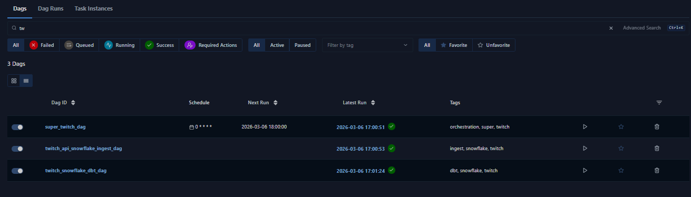
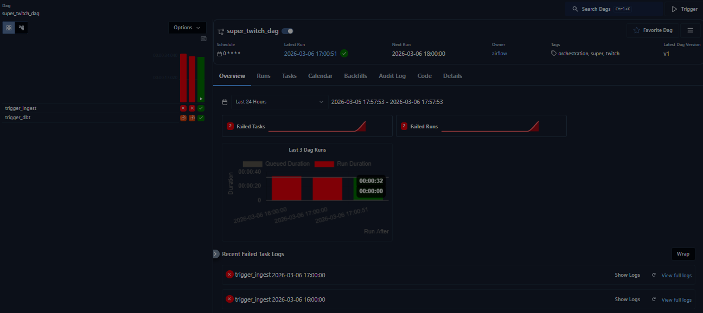
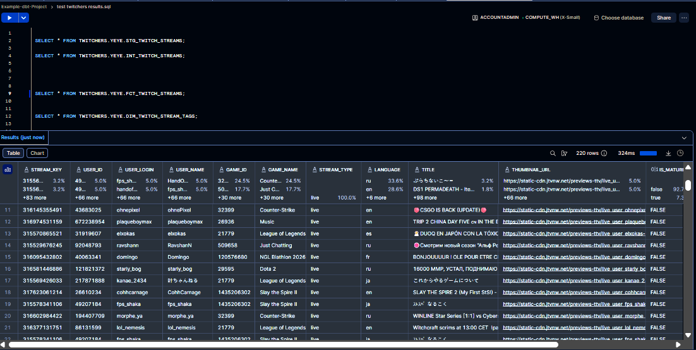

# TWITCH STREAMS ELT

This repository contains the ELT pipeline using Apache Airflow. It ingests the Twitch API livestream data into Snowflake and transforms it inside Snowflake using dbt. Apache Airflow takes responsibility of orchestration and scheduling of this process.

        Twitch API
            │
            │                                         
            │   DAG 1                                     
            │   create RAW table in Snowflake
            │   (JSON stream data)
            ▼
      ┌──────────────────────┐                       __   | 
      │      Snowflake       │                         \ /      
      │   raw twitch data    │                          / \__
      └──────────┬───────────┘                         |
                 │                               
                 │                                 Apache Airflow
                 │   DAG 2      
                 │   dbt transformation
                 │   build analytical model
                 ▼
      ┌────────────────────────────────┐
      │   Snowflake Analytical Model   │
      │       staging → marts          │
      └────────────────────────────────┘

# Prerequisites

Docker Desktop is installed and run.


# Steps

## Twitch setup
Let's setup your Twitch API Creds.

You need a Twitch Developer Account to get twitch CLIENT_ID and CLIENT_SECRET.
- Enable MFA in your twitch account.
- Open https://dev.twitch.tv/console.
- Create new project.
- Just use "https://localhost" as the server.
- Then open project settings again and see below "Client Identifier" and "Client Secret".
- Copy those and paste them in the twitch_streams_elt\dags\dags_twitch\twitch_api_snowflake_ingest_dag.py as CLIENT_ID and CLIENT_SECRET.


## Snowflake setup

Let's setup Snowflake.

In Snowflake, create of database, schema, role, user as well as grants:

```sql
CREATE ROLE IF NOT EXISTS TWITCH_ROLE;
CREATE USER IF NOT EXISTS TWITCH_USER
    PASSWORD = 'sidfj409rJJSLIDkfjkdsfj9304iojfsdkljf3iklfsd'
    LOGIN_NAME = 'TWITCH_USER'
    DEFAULT_ROLE = 'TWITCH_ROLE' 
    MUST_CHANGE_PASSWORD = FALSE     
    DISABLED = FALSE;
GRANT ROLE TWITCH_ROLE TO USER TWITCH_USER;
CREATE DATABASE TWITCHERS;
CREATE SCHEMA TWITCHERS.YEYE;
GRANT ALL PRIVILEGES ON DATABASE TWITCHERS TO ROLE TWITCH_ROLE;
GRANT ALL PRIVILEGES ON ALL SCHEMAS IN DATABASE TWITCHERS TO ROLE TWITCH_ROLE;
GRANT ALL PRIVILEGES ON ALL TABLES IN DATABASE TWITCHERS TO ROLE TWITCH_ROLE;
GRANT ALL PRIVILEGES ON ALL VIEWS IN DATABASE TWITCHERS TO ROLE TWITCH_ROLE;
GRANT ALL PRIVILEGES ON ALL SEQUENCES IN DATABASE TWITCHERS TO ROLE TWITCH_ROLE;
GRANT ALL PRIVILEGES ON ALL STAGES IN DATABASE TWITCHERS TO ROLE TWITCH_ROLE;
GRANT ALL PRIVILEGES ON ALL FILE FORMATS IN DATABASE TWITCHERS TO ROLE TWITCH_ROLE;
GRANT ALL PRIVILEGES ON ALL FUNCTIONS IN DATABASE TWITCHERS TO ROLE TWITCH_ROLE;
GRANT ALL PRIVILEGES ON ALL PROCEDURES IN DATABASE TWITCHERS TO ROLE TWITCH_ROLE;
GRANT ALL PRIVILEGES ON FUTURE SCHEMAS IN DATABASE TWITCHERS TO ROLE TWITCH_ROLE;
GRANT ALL PRIVILEGES ON FUTURE TABLES IN DATABASE TWITCHERS TO ROLE TWITCH_ROLE;
GRANT ALL PRIVILEGES ON FUTURE VIEWS IN DATABASE TWITCHERS TO ROLE TWITCH_ROLE;
GRANT ALL PRIVILEGES ON FUTURE SEQUENCES IN DATABASE TWITCHERS TO ROLE TWITCH_ROLE;
GRANT ALL PRIVILEGES ON FUTURE STAGES IN DATABASE TWITCHERS TO ROLE TWITCH_ROLE;
GRANT ALL PRIVILEGES ON FUTURE FILE FORMATS IN DATABASE TWITCHERS TO ROLE TWITCH_ROLE;
GRANT ALL PRIVILEGES ON FUTURE FUNCTIONS IN DATABASE TWITCHERS TO ROLE TWITCH_ROLE;
GRANT ALL PRIVILEGES ON FUTURE PROCEDURES IN DATABASE TWITCHERS TO ROLE TWITCH_ROLE;
```

## Docker container setup

Now, let's start the container. 

Open CMD on your PC, navigate to the git repository folder and run:
```bash
cd "E:\0_git_repos\twitch_streams_elt"
docker compose build && docker compose up -d
```

## dbt setup

Change the profiles.yml file to your needs!

## Airflow setup & run

Now, let's run the ELT Pipeline in Airflow:

First, setup the "snowflake_conn" in Airflow. Open airflow, navigate to admin -> connections and setup Snowflake connection called "snowflake_conn" using your credentials. You must specify:
- name: `snowflake_conn`
- type: `Snowflake`
- USER: `TWITCH_USER`
- PASSWORD: `sidfj409rJJSLIDkfjkdsfj9304iojfsdkljf3iklfsd`
- SERVER: `PM39302-PHD3093` (example)
- ROLE: `TWITCH_ROLE`
- WAREHOUSE: `COMPUTE_WH` (example)

---

Now in Airflow navigate to DAGs, search for twitch and activate all three dags.


Run the super_twitch_dag. (hint: this dag also has a schedule!)


# Result

Open your Snowflake and see the views created from the twitch stream data: `FCT_TWITCH_STREAMS` as well as `DIM_TWITCH_STREAM_TAGS`.



